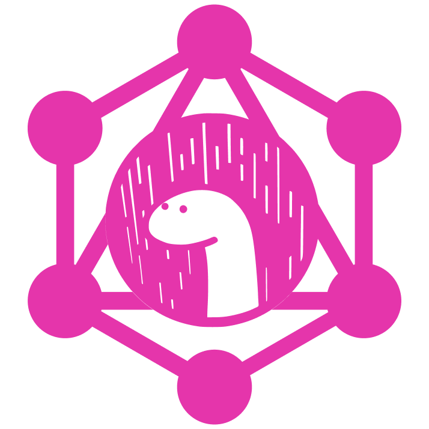

<div align="center">
  
  <br /><br />

[![nest badge][nest-badge]](https://nest.land/package/gql) [![GitHub Workflow Status][gh-actions-img]][github-actions]
[![Codecov][codecov-badge]][codecov] [![][docs-badge]][docs] [![][code-quality-img]][code-quality]

</div>

# gql

Universal [GraphQL](https://www.graphql.com/) HTTP middleware for Deno.

## Features

- ✨ Works with `std/http`, [tinyhttp](https://github.com/deno-libs/tinyhttp-deno) and [Opine](https://github.com/asos-craigmorten/opine) out-of-the-box
- ⚡ [GraphQL Playground](https://github.com/graphql/graphql-playground/tree/master/packages/graphql-playground-html) integration (via `graphiql: true`)

## Get started

### Vanilla

The simplest setup with `std/http`:

```ts
import { serve } from 'https://deno.land/std@0.90.0/http/server.ts'
import { GraphQLHTTP } from 'https://deno.land/x/gql/mod.ts'
import { makeExecutableSchema } from 'https://deno.land/x/graphql_tools/mod.ts'
import { gql } from 'https://deno.land/x/graphql_tag/mod.ts'

const typeDefs = gql`
  type Query {
    hello: String
  }
`

const resolvers = {
  Query: {
    hello: () => `Hello World!`
  }
}

const schema = makeExecutableSchema({ resolvers, typeDefs })

const s = serve({ port: 3000 })

for await (const req of s) {
  req.url.startsWith('/graphql')
    ? await GraphQLHTTP({
        schema,
        graphiql: true
      })(req)
    : req.respond({
        status: 404
      })
}
```

Then run:

```sh
$ curl -X POST localhost:3000/graphql -d '{ "query": "{ hello }" }'
{
  "data": {
    "hello": "Hello World!"
  }
}
```

Or in [GraphQL Playground](https://localhost:3000/graphql):


[docs-badge]: https://img.shields.io/github/v/release/deno-libs/gql?label=Docs&logo=deno&style=for-the-badge&color=DD3FAA
[docs]: https://doc.deno.land/https/deno.land/x/gql/mod.ts
[gh-actions-img]: https://img.shields.io/github/workflow/status/deno-libs/gql/CI?style=for-the-badge&logo=github&label=&color=DD3FAA
[codecov]: https://coveralls.io/github/deno-libs/gql
[github-actions]: https://github.com/deno-libs/gql/actions
[codecov-badge]: https://img.shields.io/coveralls/github/deno-libs/gql?style=for-the-badge&color=DD3FAA
[nest-badge]: https://img.shields.io/badge/publushed%20on-nest.land-DD3FAA?style=for-the-badge
[code-quality-img]: https://img.shields.io/codefactor/grade/github/deno-libs/gql?style=for-the-badge&color=DD3FAA
[code-quality]: https://www.codefactor.io/repository/github/deno-libs/gql
